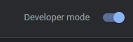
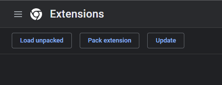
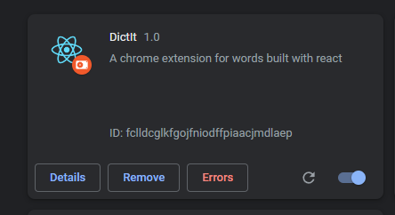

# DictIt Chrome Extension

## What's the project about

DictIt is a tiny chrome extension for searching words: find their meaning and synonyms (still in development) thanks to the [`WordsAPI`](https://wordsapi.com) (important note: for the time being the extension in built with the [`freedictionaryAPI`](https://dictionaryapi.dev) but I'll update it).

## How to build and run the extension

In order to use the extension you first need to install the dependencies with

```
npm install | yarn install
```

and to build it with

```
npm run build | yarn build
```

Then you need to go to [`chrome://extensions`](chrome://extensions), enable the developer mode (in the top-right corner)



and select "Load unpacked" (in the top-left corner)



Now you should see the extension like this



And so you're ready to go!
